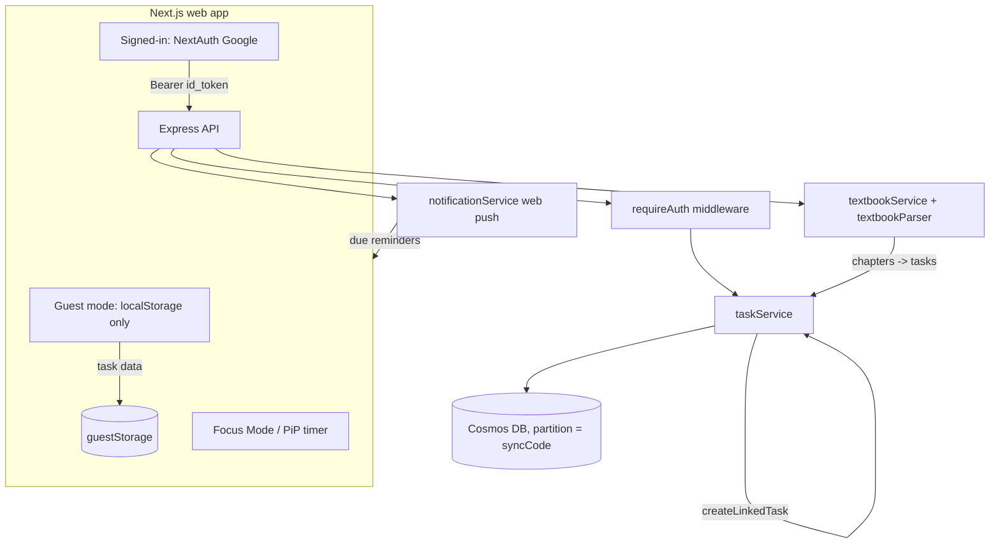

# AI Study Layer — Repo Map and Increment Plan (v1)

Status: PLAN ONLY. No feature code written yet. Awaiting approval before implementation (per claude-code-prompt.md rule 3).

---

## Part A — Repo map (verified against the actual code)

### Stack
- Frontend: Next.js 15 (App Router), React 18, TypeScript, Tailwind. State via Zustand stores (`frontend/store/*`). Auth via NextAuth Google provider plus a guest mode. Deployed as an Azure Container App (`taskflow-frontend`).
- Backend: Express + TypeScript (`backend/src/server.ts`). Deployed as an Azure Container App (`taskflow-backend`).
- Data layer: Azure Cosmos DB via `backend/src/services/cosmosService.ts`. Partition key is `syncCode`, which stores the user identity value (email for signed-in users, or a guest/sync id).
- Object storage: Azure Blob via `backend/src/services/blobService.ts` (already used for images). Candidate store for rendered PDF page images.
- Build/deploy: both services have a `Dockerfile` (node:20-alpine, `npm run build`). `deploy-*.sh` run `az containerapp up --source .`, which builds from the Dockerfile. This is a Docker image build via ACR, NOT the Oryx buildpack. The SDP/prompt assumption of Oryx is incorrect for this repo; correcting it here.

### Existing entities (`backend/src/types/index.ts`)
- Task: `id, title, description, status, progress, subtasks[], syncCode, sourceSubtaskId?, createdAt, updatedAt, due/scheduling fields`.
- Subtask (nested in Task): `id, title, isCompleted, isArchived, parentTaskId, parentSubtaskId?, order, linkedTaskId?, estimatedMinutes?, stepType?, status?, isComposite?, depth?, children?[]`, plus learning fields (`strategyTag, interactionType, confidenceLevel, nextReviewAt`).
- Textbook (already exists): a book-like entity with chapters and a `linkedTaskId` per chapter, managed by `textbookService.ts`.

### Key existing mechanisms the study layer must reuse (not reinvent)
- No-login identity: guest mode is client-side. `frontend/lib/guestStorage.ts` keeps `guest_id`, `guest_mode`, `guest_tasks` in localStorage. `frontend/lib/api.ts` short-circuits all task data operations to localStorage when in guest mode, so guests never call the backend for task data. Signed-in users send a verified Google ID token (Authorization: Bearer), enforced by `backend/src/middleware/auth.ts` (`requireAuth`) on `/api/tasks`.
- Existing PDF pipeline: `POST /api/textbooks/parse/pdf` extracts text via `pdf-parse` then `textbookParser.extractChaptersFromPDF` (Cloudflare Workers AI, gemma-4-26b). `POST /api/textbooks` persists a textbook; `POST /api/textbooks/:id/generate-tasks` -> `textbookService.createTasksFromTextbook` turns chapters into Tasks. This is the seam the study layer extends.
- Follow-up Tasks: `taskService.createLinkedTask(title, ..., sourceSubtaskId)` creates a new Task referencing a source subtask and writes `linkedTaskId` back. Used for item-to-item momentum.
- Notifications: `notificationService.ts` (web push, VAPID) with `sendToUser` and typed helpers (`notifyDueDateReminder`, `notifyLinkedTaskCreated`, etc.); `webPushService.ts`. Reuse `notifyDueDateReminder`-style calls for review-due triggers. A scheduling/surfacing path exists in `schedulingService.ts` and `timerService.ts`.
- Focus Mode: `frontend/components/focus/GalaxyFocusView.tsx` shows one item at a time; `useReliableTimer` drives the timer; PiP via `useVideoPictureInPicture` with the blue-to-red treatment.
- Payments: none. No Stripe or Lemon Squeezy code exists. Greenfield.
- Gating surface: web (the Next.js app). There is an `electron-timer` desktop helper but no native iOS app. So Lemon Squeezy external/inline checkout is compliant; the iOS IAP caveat does not apply to the current surface. To confirm with owner.

### Existing architecture (baseline, before any change)

---

## Part B — Open decisions to confirm before/within increments

1. Data model reconciliation: introduce new Cosmos containers (`books`, `pages`, `regions`, `reviewItems`, `entitlements`) versus extending the existing `textbooks` container. Proposal: new containers for Page/Region/ReviewItem/Entitlement, and treat the existing Textbook as the Book (or add a `book` document type) to avoid a parallel concept. Confirm.
2. Document AI provider: Azure AI Document Intelligence (preferred, matches existing Azure subscription `birth2death-imagine-cup-2026`). Needs a new resource + key. Confirm provisioning.
3. Headroom mode: backend is TypeScript/Express. The new tiering LLM call is new code, so an in-process `headroom-ai` wrapper at that call site is feasible; the existing call sites use `@azure/openai` and raw `fetch` (Cloudflare), which Headroom's TS adapters do not directly wrap, so the proxy sidecar is the alternative. Proposal: in-process `headroom-ai` around the new tiering call and the Document AI JSON; pin an exact version. Confirm mode before wiring (per prompt 2a).
4. Guest vs backend for study data: task data for guests is localStorage-only today. PDF processing and Document AI must run server-side (secrets, cost). Proposal: study processing is always backend, keyed by the same identity model; a guest gets a server-side record keyed by guest id. This is a deviation from "guests never hit backend" and needs confirmation, because saliency/Document AI cannot run client-side.
5. "First book free" counting against the no-login identity: define per identity (guest id or email) server-side, resistant to trivial localStorage reset. Confirm the exact rule.
6. Where review items live: separate `reviewItems` container that generates Tasks on due, versus storing directly as Tasks. Proposal: separate container (SM-2 state) that generates Tasks when due, reusing notifications and Follow-up Tasks.

---

## Part C — Increment plan (each is a separate, check-in-gated change)

Mapped to the 8 increments in claude-code-prompt.md section 4, adjusted to real modules. Each increment pauses for review. No emoji in any code or UI string.

### Increment 0 (this deliverable)
- [x] Read SDP.md, user-process-flow.md, claude-code-prompt.md.
- [x] Verify stack, entities, and reuse points against source.
- [x] Write this repo map and plan.
- [x] Owner approval of plan and open decisions (Part B).
  - Decision 1 (server-side PDF processing for the study layer): approved.
  - Decision 2 (Document AI provider): Azure Document Intelligence Layout, with a provider-swap seam for later Google or self-host (Surya/PaddleOCR).
  - Decision: server-side processing keyed by existing identity (guest id / email) is acceptable; no-login preserved.

### Increment 1 — PDF ingest + Document AI + persist Page/Region (process-once + cache) + Headroom
- [x] Provision Azure Document Intelligence (resource `taskflow-docintel`, F0 free tier, eastus). Endpoint + key added to backend/.env (gitignored). Smoke-tested prebuilt-layout on a sample PDF: succeeded, returns paragraphs/tables with polygons/bboxes.
- [x] Provider seam: `backend/src/services/documentAi/` (`types.ts`, `azureDocumentIntelligence.ts`, `index.ts`) with a `DocumentAiProvider` interface and an Azure implementation returning normalized regions (type, fractional bbox, content, table_structure). Provider selected by `DOCUMENT_AI_PROVIDER` env, default azure. Verified against the real API: a sample PDF returned heading/text/table regions with in-range fractional bboxes and 5x3 table structure.
- [x] Add study types: `backend/src/types/study.ts` (`Book`, `Page`, `Region`, `RegionType`, `FractionBox`, `TableStructure`). Book reconciliation with Textbook still to finalize at persistence step.
- [x] Cosmos persistence: new containers `studyBooks` (partition /ownerRef), `studyPages` and `studyRegions` (partition /bookId) in `cosmosService.ts`; `studyService.ts` with findCachedBook/saveProcessedBook/listBooks/getBook/getPages/getRegions. Process-once via (ownerRef, sourceHash).
- [x] New route `POST /api/study/books` (`routes/study.ts`, mounted in server.ts): multer PDF upload (type application/pdf, 50MB cap), sha256 content hash, dedupe -> cached, Document AI analyze, persist. Plus GET /books and GET /books/:id.
- [x] Persist Page + Region to Cosmos. Verified: upload returns 201 with 40 regions; re-upload returns cached:true same id; GET detail returns 1 page + 40 regions (heading/text/table) with fractional bboxes; a different owner sees 0 books (per-owner isolation).
- [x] Headroom token-measurement seam (`services/headroom.ts`); logs the Document AI JSON baseline (~21963 tokens on the sample) that Increment 2's tiering call will compress.
- DEVIATION: original PDF and per-page image rendering to Blob deferred to Increment 3 (viewer), to avoid pulling a heavy server-side PDF rasterizer into Increment 1. Page.renderUri stays unset for now.
- SECURITY NOTE (for the section 6 pass): /api/study currently trusts x-user-id as ownerRef (guests must work, no token). Cross-owner read is prevented by per-owner queries, but a client could still claim another ownerRef. Entitlement and hardening land in Increment 7 and the security pass.
- [x] No tiering yet (Increment 2).

### Increment 2 — Layer 1 tiering from structural signals (DONE)
- [x] `services/studyTiering.ts` `assignTiers(regions)`: rule-based, deterministic, no LLM (per SDP "structural signals only"). Tier 1 = headings, captions, definitions/key-terms; Tier 2 = summaries, review questions; Tier 3 = body text, figures, tables. Wired into the ingest pipeline so regions persist with tier.
- [x] Seams left: `Region.tierSource` ('structural' now; 'past-exam' and 'reweighted' reserved); `reweightTiers()` no-op hook for per-user failure re-weighting (Layer 3); a documented spot for the optional LLM term-extraction + Headroom compression.
- [x] Verified: unit test covers all rules (heading/caption/figure/table and definition/summary/review-question/question text). Live ingest persists a valid tier on every region with tierSource=structural.
- NOTE: v1 tiering makes no LLM call, so Headroom stays measurement-only until the term-extraction step is added.

### Increment 3 — Layer 2 viewer: faithful render + mask overlay + three toggle modes (DONE)
- [x] Backend: store original PDF privately in Blob on ingest (`book.pdfBlobName`); add owner-verified `GET /api/study/books/:id/pdf` that streams it (never a public URL). `blobService.uploadBuffer`/`downloadToBuffer` added. CORS allowedHeaders gains `Range` so pdf.js can fetch. Verified: owner gets 200 application/pdf (exact byte match), other owner gets 404.
- [x] Frontend: `components/study/StudyViewer.tsx` + route `app/study/[id]/page.tsx`. Renders each page with pdf.js (pdfjs-dist 4.8.69, worker in public/) onto a canvas and overlays absolutely-positioned, tier-colored mask divs aligned to fractional bboxes.
- [x] Three toggle modes: show all (translucent tier overlays), hide overlay regions (blank all tiered regions), show only anchors (blank tier 2 and 3, keep tier 1 visible). Chosen render approach: pdf.js client-side (no server rasterization), per owner decision.
- [x] Verified end to end (Playwright): page route 200, PDF renders (canvas 900px), 40 overlays, hide -> opaque, anchors -> tier1 visible and tier3 blanked, zero failed requests. Fixed an SSR crash by importing pdfjs-dist dynamically inside the effect (Node 20 lacks Promise.withResolvers).
- NOTE: no study entry UI yet (reach the viewer at /study/:id). Entry/upload UI lands with later increments.

### Increment 4 — Layer 2 blank-to-full progressive reveal (DONE)
- [x] Added a 'reveal' mode to StudyViewer with a stage stepper (0..3, Back / Reveal next). Stage 0 shows only tier-1 anchors; stage 1 adds tier 2; stage 2 adds tier-3 text; figures and tables reveal last at stage 3 (caption-to-figure recall, since captions are tier 1). Masked regions are blanked; revealed regions show the page underneath.
- [x] Verified (Playwright) on the sample: masked-region count steps 37 -> 37 -> 2 -> 0 across stages (monotonic to zero), figures/tables reveal last, tier-1 anchors never masked.

### Increment 5 — Layer 3 scheduler + TaskFlow task generation (IN PROGRESS)
- [x] 5.1 Data + scheduler: `studyReviewItems` Cosmos container (partition /ownerRef); `ReviewItem` type; `studyReviewService` with pure SM-2 `applyGrade`, `computeRetention`, `isRecallTarget`, `generateReviewItems` (recall targets = tier 1/2 + figures/tables, due now, idempotent), `getDueItems`, `booksWithDueItems`. Wired `generateReviewItems` into ingest. Unit tests PASS (interval 1->6->16, fail reset, ease floor 1.3, retention decay; recall-target selection).
- [x] 5.2 Routes: `GET /api/study/review/due` (enriched with each item's region) and `POST /api/study/review/:itemId/grade`. Live verified: ingest creates 5 items (3 tier1 + 2 tables), due returns them with region, grade q5 reschedules to future, due count drops.
- [ ] 5.3 TaskFlow task generation: daily sweep creates one Task per book with due items, reusing taskService.createTask + notificationService.notifyDueDateReminder; createLinkedTask for momentum.
- [ ] 5.4 Frontend review-session UI (reuse Focus Mode + StudyViewer overlay): load first due item, recall then reveal, grade control, auto-advance.

### Increment 6 — Layer 3 honest loss-aversion + ADHD-safe streak
- [ ] Show real retention estimate (no fake countdown); reuse PiP blue-to-red where practical.
- [ ] Streak with freeze, forgiving recovery, weekly goals, no guilt messaging.

### Increment 7 — Monetization (Lemon Squeezy, inline, no pricing page)
- [ ] `entitlements` container (scope, lemonsqueezy_order_id, license_key, email). Server-side per-book gating; book 1 free, book 2+ paid.
- [ ] Inline Lemon Squeezy checkout (Lemon.js overlay) showing price + one-line value; unlock in place on success.
- [ ] Webhook signature verification server-side; license-key activation/validation via Lemon Squeezy API; email/license recovery; no forced signup; communicate device-local nature.

### Increment 8 — Premium seam only
- [ ] Gate + entitlement scope for past-exam mapping. Engine NOT built.

### Cross-cutting (per prompt 4a and 6)
- [ ] Keep code-accurate Mermaid diagrams updated (data model, module view, upload-to-task sequence) using real names.
- [ ] Test plan, then tests per increment (region+tier on sample PDF; viewer modes + reveal; scheduling + task generation; entitlement gating + cannot self-grant; no-login flow intact).
- [ ] Security pass (no secrets client-side; webhook signature; server-side entitlement; PDF validation; per-user scoping; Headroom in our infra only).

---

## Review section
(To be filled in as increments land.)
